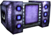
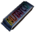
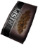
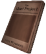
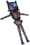
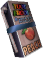
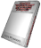
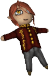

[English](README.md)

## Some Weird Weapons Mod ~ GZDoom Edition

**SWWM GZ** приносит в **GZDoom** коллекцию "лучшего" нестандартного оружия, которую я сделал для **Unreal Tournament**, а также множество новых вещей, которые туда не вошли.

Он содержит оружие и предметы, обновлённые и восстановленные из старых проектов, таких как предыдущие записи **SWWM**, а также побочный проект **Zanaveth Ultra Suite**, а также, в частности, основную серию **UnSX**, которая никогда по-настоящему не увидела свет, так как вся работа, проделанная до сих пор, потеряна навсегда. Здесь и там могут быть некоторые оригинальные вещи, просто чтобы оживить их.

Он также включает ***МНОГО*** истории из **Мультивселенной UnSX**. Я в значительной степени сходил с ума от всего, что вы можете прочитать, и я надеюсь, вам понравится погрузиться в этот огромный мир, полный его многочисленных персонажей и их историй.

Это первый полностью оригинальный мод, который я делаю с момента моей работы над **Doom Tournament** и **Doomreal**, и он эффективно основан на навыках, которые я приобрёл, работая над ними, а также на некоторых их кодах, которые служат для него своего рода фундаментом.

Надеюсь, вам понравится взрывать колени демонов.

 — *Marisa*

## Игрок

Вы **Бот-подрывник лаборатории Акари**, один из самых первых юнитов, только что с завода. Вы являетесь величайшим достижением компании в области боевых единиц, управляемых ИИ, обучены эффективно использовать все виды оружия, изготовлены из высококачественной брони и прочных, но гибких соединений. Чтобы продемонстрировать свои способности, ваш создатель решил отправить вас на борьбу с демоническим вторжением, вызванным *"этими большими вонючими идиотами из **ОАК**"*. Пришло ваше время надрать задницу и взорвать их.

Дополнительные особенности:

 - **Программируемые цветные метки:** Расположены вокруг различных частей тела, позволяет быстро и легко различать несколько единиц (недоступно из-за *ограничения движка™*, так они всегда зелёные).
 - **Счастливый Воротник:** Что-то, что ваш создатель дарит всем своим творениям. Уменьшает повреждения на 75%, когда вы менее чем на 25% здоровы.
 - **Меню пользователя:** Одним нажатием кнопки откройте специальное меню, чтобы просмотреть всю свою статистику в деталях, информацию о переносимых предметах и оружии, просмотреть обширную библиотеку информации о вещах, с которыми вы сталкиваетесь, и получить доступ к магазину для покупки дополнительных предметов с вашим счётом.
 - **Магнитный ремень:** Облегчает перезарядку некоторого оружия в пути.
 - **Брелок:** Для того, чтобы носить с собой все ваши ключи и другие ценные вещи.
 - **Карманные контейнеры Хаммерспейс™:** Они будут хранить и размещать ваши боеприпасы и оружие по запросу. Ёмкость для хранения боеприпасов можно увеличить, найдя модули **Хаммерспейс™ Эмбиргенер**.
 - **Форкс Джетбурст™:** Может использоваться для быстрых рывков в любом направлении или даже для коротких взлётов.
 - **Целевой массив:** Отслеживает ближайших противников и предоставляет основную информацию об их здоровье. Совместим с картографическими модулями **Всевидящего зрения™** для отслеживания ключевых объектов и ближайших выходов. Также можно выделить ближайшие предметы, которые можно подобрать, удерживая специальную кнопку.
 - **Дисплей МилогоСмайлика Акари Лаб™:** Оборудован на вашем смотровом козырьке, чтобы показать широкий спектр предопределённых выражений лица, чтобы передать простые эмоции другим.
 - **Войсбокс ГромкийМальчик Акари Лаб™:** Позволяет вам И З Д А В А Т Ь  З В У К И. Дополнительные параметры голоса будут доступны через дополнения. Обратите внимание, что голос по умолчанию на японском языке, но при их наличии будут предоставлены субтитры.
 - **Получатели предметов по запросу:** AKA "руки". Вы можете подбирать определённые предметы на расстоянии, нажав Использовать (в основном это обходной путь для любых причуд, которые могут возникнуть из-за предметов в этом моде, имеющих изменённое столкновение).

**Примечание:** Поскольку вы робот, вы можете плавать бесконечно долго, а также невосприимчивы к ядам.

## Оружие

Арсенал, который предлагает этот мод, состоит в основном из дурацкого оружия, которое было моей специализацией в течение многих лет.

Некоторое оружие может иметь дополнительные функции, прикреплённые к кнопкам **Перезарядка** или **Приближение**, поэтому не забудьте привязать их тоже.

Всё оружие также имеет быструю атаку в ближнем бою с помощью кнопки **Состояние оружия 1**, это необязательно, но может также помочь привязать его.

Если у оружия нет действий ни на кнопках перезарядки, ни на кнопках приближения, его можно заменить каким-нибудь особым действием в режиме ожидания, например, вращением или возиться с ним.

На данный момент это всё оружие, запланированное для первого выпуска. Позже будет добавлено больше (до тех пор я буду дразнить вас пустыми файлами ZScript :P).

### Глубокий Удар (слот 1) ~ Заменяет стартовое оружие Fist, Staff, Hexen.

Фирменное оружие ближнего боя **SWWM**, **ударный молот** на стероидах.

**Основной огонь:** Ваш обычный толчок сжатым воздухом, вы можете использовать его, чтобы отражать снаряды или отталкивать врагов, которые блокируют ваш путь.

**Вторичный огонь:** Заряженный выстрел, для которого требуется полный воздух. Выпускает мощную *"воздушную пулю"*, которая разорвёт всё на своём пути.

**Перезарядка:** Накачать ещё воздуха.

По умолчанию экипирован при появлении игрока.

### Толкатель (слот 1) ~ Заменяет бензопилу, перчатки некроманта, топор Тимона.

Что должно было стать новым оружием ближнего боя в **Ultra Suite 2**, но этого не произошло. Прокачанный отбойный молоток.

**Основной огонь:** Сверлите всё, с чем сталкиваетесь.

**Вторичный огонь:** Перетяните сверло обратно, затем нажмите кнопку и нажмите обратно с огромной силой. Это скорее всего прорвёт дыру в любом месте, но если вы промахнётесь, есть шанс, что вы потеряете хватку на оружии и оно будет лететь, пока не попадёт во что-нибудь.

### Пушка Взрывадиум (слот 2) ~ Заменяет пистолет, эльфийский жезл, стартовое оружие Hexen.

Основное огнестрельное оружие, ещё один продукт этой серии, но более изменчивый, чем когда-либо. Карманная ракета, старое верное ружьё, в котором используются пули, наполненные **Взрывадиумом**, чтобы нанести дополнительный ущерб.

**Основной огонь:** Обычный старый добрый взрывной выстрел. Имеет значительное отбрасывание, но не смертельный урон.

**Вторичный огонь:** *"Взрывная перезарядка"*. Вместо того, чтобы просто выбросить магазин, как обычно, потянув за булавку внизу, он превращается в гранату, которую вы можете бросить во врагов для увеличения урона. Выход будет пропорционален оставшимся в нём боеприпасам.

**Перезарядка:** Обычная перезарядка, ничего больше, никаких взрывов или чего-то ещё.

По умолчанию экипирован при появлении игроках. Бесконечный боезапас.

Если вам удастся получить второй, вы можете использовать их двумя руками, и в этом случае вторичный огонь вместо этого стреляет из вашего оружия для левой руки.

### Распылитель (слот 3) ~ Заменяет дробовик, Эфирный арбалет, Змеиный посох.

Исходя из стороны моддинга **Doom**, этот пистолет действительно обладает мощью, но его довольно сложно использовать.

**Основной огонь:** Выстрел, да. В зависимости от заряженных боеприпасов, эффект может отличаться.

**Вторичный огонь:** Переключает тип боеприпасов для следующего выстрела.

**Перезарядка:** Выгрузите текущие патроны и загрузите новые. Неизрасходованные снаряды снова добавляются в соответствующий отсек боеприпасов (или сбрасываются, если вы не можете удержать больше).

**Распылитель** использует боеприпасы 10-го калибра, очевидно, просто для того, чтобы сделать его более мощным из-за повышенной отдачи.

### Патроны 10кал. ~ Заменяет обойму / картечь, Кристалл для эльфийского жезла / Эфирные стрелы

Доступны следующие типы, с разной вероятностью появления в зависимости от
заменяемого предмета, также могут входить в наборы:

 - **Стандартная картечь (красный):** Множество крошечных гранул, готовых разорвать врагов в клочья. Самый обычный.
 - **Пуля (зелёный):** Сосредоточенный урон в одном большом снаряде. Обычный.
 - **Дыхание дракона (белый):** Жгучая боль в одном выстреле на все, что перед вами. Не очень эффективно под водой, но всё ещё имеет небольшие тепловые повреждения. Несколько редкий.
 - **Соль Кинулум (синий):** Очень летучие осколки **Кинулум**, оставляющие за собой след горящей плазмы. Редкий.
 - ***Пуля "Трахни это дерьмо"* (чёрный):** Особый тип самодельных зажигательных боеприпасов, который мог бы придумать только абсолютный сумасшедший. Поджигает всё (потенциально включая себя). Очень редкий.
 - ***"Шар"* (фиолетовый):** - Большой свинцовый шар, - сказал Нафф. Довольно редок.
 - **Золотая пуля (цвет не требует пояснений):** Чрезвычайно редкий, но очень ценный вид. Выстреливает сабом, наполненным очень плотным, высококачественным **взрывным зарядом**, пуля также содержит немного золотого блеска, но это только для галочки. Ясно разработан кем-то совершенно безумным и определённо гарантированно не выйдет из строя и не взорвёт ваш пистолет, ваши руки, ваши руки и остальную часть вашего тела. В отличие от других, этот доступен только как редкая добыча из сильных монстров (более 1000 ед. здоровья) и боссов. Они также могут появляться в **коробках удачи**.

### Взрыватель Стен (слот 4) ~ Заменяет SSG, Эфирный арбалет, Ледяные осколки.

Невероятно мощное оружие, любезно предоставленное вечно-избыточным оружием **Пушки Блакманн**. Спортинг 5 групп по 5 стволов, всего 25. Всё перед вами будет мертво. Нельзя использовать зажигательные патроны или золотые пули.

**Основной огонь:** Выстрел из одного ствола за раз.

**Вторичный огонь:** Выстрел сразу пятью стволами, берегитесь отдачи.

**Третичный огонь (Приблизить):** Выстрел из всех стволов одновременно, но на этот раз ДЕЙСТВИТЕЛЬНО следите за отдачей.

**Перезарядка:** Перезарядка (очевидно). Процесс очень сложный, поэтому я объясню его лучше в виде списка:

 - Меню откроется после нажатия на боковой рычаг. Здесь вы можете поставить боеприпасы в очередь для загрузки. Элементы управления отображаются постоянно.
 - В одиночной игре игра приостанавливается, когда вы находитесь в очереди, так что вы можете не торопиться, но в кооперативе вам лучше иметь кого-то, кто прикрывает вас, пока вы микроменеджируете этого зверя.
 - Во время загрузки снарядов вы можете отменить, удерживая кнопку перезагрузки.
 - Для такого опытного боевого робота, как вы, перезарядка должна быть очень быстрой. Максимум 10 секунд для всех 25 стволов.

Людям нравится называть его ***"ВзрывательЯиц"***. Вы поймёте почему.

### Потрошитель (слот 5) ~ Заменяет пулемёт, Коготь дракона, Довод (рукоять)

Удовольствие от шрапнельного спама. Обрушьте на врагов жаркую дымящуюся боль.

**Основной огонь:** Разверните завесу из горячего свинца, рикошетируя и разрывая всё в клочья.

**Вторичный огонь:** Выстреливает весь патрон. Горячий свинец будет развернут везде, где он попадется.

**Третичный огонь (Приблизить):** Переключение между широким разбросом (по умолчанию) и узким разбросом для основного. Кроме того, также влияет на эффективную дальность вторичного огня, позволяя вам сбрасывать эти бомбы дальше.

Это оружие заставило **Unreal Engine** плакать, так что **GZDoom** тоже может сильно пострадать.

### Патроны Потрошитель ~ Заменяет ящик с боеприпасами, Когтевой шар

Маленькие связки веселья (в форме горячего свинца), которые можно найти либо в виде отдельных блоков (иногда сгруппированных), либо по шесть штук. Нет объяснения, почему у них нацарапано лицо **owo**.

### Хэлл Блейзер (слот 6) ~ Заменяет Ракетомёт, Жезл феникса, Молот возмездия

Ещё одно фирменное оружие из серии **SWWM**. На этот раз в его третьей и гораздо более улучшенной версии.

**Основной огонь:** Выстрел прямо вперёд раскалённой пылающей ракетой.

**Вторичный огонь:** Выстрелить ракету как гранату, которая будет отскакивать.

**Третичный огонь (Приблизить):** Сменить тип боеприпасов, есть четыре варианта (см. Раздел боеприпасов ниже).

Эта штука более взрывоопасна, чем кажется, поэтому, если вы читаете это, Икар, ***НЕ*** используйте её с близкого расстояния.

### Хэлл блейзеры ~ Заменяет ракеты, Пламенный шар

Боеприпасы для **Хэлл Блейзер** доступны в виде отдельных единиц или пакетов. Есть четыре типа:

 - ***"Блейзер"* ракеты:** Боеприпасы стандартные, взрывоопасные.
 - ***"Меткие ракеты"* кассетные бомбы:** Все виды маленьких кусочков, которые летают после первого взрыва.
 - ***"Опустошитель"* зажигательные бомбы:** Широкий диапазон, пламя охватит практически всё вокруг себя.
 - ***"Палач"* боеголовки:** Чёртово ядерное оружие, вам лучше держаться на расстоянии, потому что они ***СИЛЬНЫЕ***.

### Карабин Биоспарк (слот 7) ~ Заменяет Плазменная пушку, Посох ада, Огненный шторм

Реликвия былых времен **UnSX**. Мощное энергетическое оружие, использующее то, что лучше всего описывается как *"разумная молния"*.

**Основной огонь:** Маленькие сгустки энергии, которые взрываются при ударе. Держите для быстрого огня.

**Вторичный огонь:** Выстрел сосредоточенным лучом. Очень старая вещь из оригинального воплощения **UnSX I**. Может пробить несколько твёрдых целей. Также может использоваться для скоростной стрельбы.

**Третичный огонь (Приблизить):** Развернуть капсулу, которая выпускает массивную сферу чистой энергии, которая будет отслеживать любые враждебные цели. Он будет разрывать всё и даже отскакивать от поверхностей, но его срок службы довольно ограничен.

Если луч попадает в любой из других энергетических шариков, они взорвутся с сильно увеличенным уроном и дальностью. Обратите внимание, что можно переключаться между основным и дополнительным режимами при быстрой стрельбе, что делает эту комбинацию просто вопросом точного времени.

### Биоспарк юнит ~ Заменяет ячейки, руны

Боеприпасы для Карабина Биоспарк. Несмотря на небольшой размер, они содержат много энергии.

### Серебряная пуля JET (слот 8) ~ Заменяет плазменную винтовку, Посох ада, Дуга смерти

Совершенная модель легендарной серии **Серебряной пули** от **Пушки Блакманн**. Более легкий (43 кг) вариант с меньшим калибром (1.150) предыдущей модели 1.350 **БЕГЕМОТ** снят с производства, поскольку считается непрактичным.

**Основной огонь:** Выстрел. Повторное нажатие зарядит следующую пулю.

**Вторичный огонь:** Подбирает боеприпасы для следующей перезарядки.

**Перезарядка:** Перезарядка (что ещё нового) или сменить типы боеприпасов.

**Приблизить:** Нажмите и удерживайте, чтобы войти в режим прицеливания. Отпустите, чтобы выбрать желаемый уровень масштабирования (можно увеличить до 16x). Нажмите ещё раз, чтобы выйти из режима прицеливания.

Это оружие обычно не рекомендуется для использования людьми вне силовой брони. Хорошо, что тогда ты не человек. Тем не менее, реактивные двигатели с компенсатором отдачи потенциально могут нанести вам вред, если у вас нет брони, так что будьте осторожны.

Обратите внимание, что наклон лежа (приседание) автоматически отключает компенсаторы отдачи, увеличивая потенциальный урон от пуль, но также снижая вашу подвижность.

### Пули 1.150 ЗСВ ~ Заменяет ячейки, руны

В пулях **вЗрывной Супер Взрыв** калибра 1.150 используется кумулятивный заряд **Взрывадиум**, который выстреливает с достаточной энергией для достижения относительно высокой скорости, позволяя их массивному телу пробивать несколько целей, включая стены. Их трудно найти, поэтому спаунов мало, и они даже не появляются в **Хаммерспейс Эмбиргенер**, только в **Фабрикаторах более высокого уровня**.

В мире они могут появиться как запасные патроны или полные магазины. Каждые пять поднятых пуль автоматически превращаются в полный магазин в вашем инвентаре.

### Пули 1.150 ТБЧ ~ Заменяет ячейки, руны

Более взрывоопасный аналог **ЗСВ**. Эти снаряды **головки фугасного взрыва**, лично названные **генеральным директором Пушки Блакманн** **Германом Э. Ишером** как ***"Толстые Бомбы Чод"***, пробивают стены при ударе, ударяют всё, что стоит за ними, а в некоторых случаях могут снести и саму стену.

Те же условия появления, что и у стандартных пуль.

### Конфетная пушка (слот 9) ~ Заменяет BFG9000, Огненная булава, Кровавый бич (обломок)

Созданный из старого неизданного мини-мода оружия, **Candy Gun** похож на **Пушку Взрывадиум** на стероидах (или, точнее, на клубничных конфетах и поп-роках).

**Основной огонь:** Разрывные леденцы. Взрывы - лакомство от боли.

**Вторичный огонь:** Как и его более слабый аналог, магазин вооружён и заряжен с крайними предубеждениями.

**Перезарядка:** Делает то, что вы ожидаете.

Удерживая основной огонь в течение первых нескольких секунд альтернативного огня бросит само оружие, вооруженное и готовое взорваться, если оно поразит кого-либо или что-либо. Зона взрыва для этого довольно нелепа. Кстати, запасные пистолеты можно держать (до четырёх).

### Пули конфетной пушки ~ Заменяет ячейки, руны

Патроны для этого зверя. Магазины не появляются в **Эмбиргенерах**, только в **Фабрикаторах самого высокого уровня**.

В мире можно найти запасные патроны или полные магазины. Каждые семь поднятых пуль автоматически превращаются в полный магазин в вашем инвентаре.

### Артефакт Юнукрон (слот 0) ~ Заменяет BFG9000, Огненная булава, Жезл духов (дуга)

Широко известная как ***"Пушка смерти"***. Одно из четырёх абсолютных орудий, созданных безумным богом-диктатором **Недошианом** перед его поражением... или, по крайней мере, его очень подробная копия.

**Основной огонь:** Инициировать процесс заряда для одного выстрела. После того, как зарядка завершится, выстрел будет выпущен вторым нажатием. Обязательно держитесь на некотором расстоянии от ваших целей, потому что полученный взрыв может задеть вас в своей цепной реакции, и в этом случае нет ничего, что могло бы предотвратить вашу смерть.

**Вторичный огонь:** Поменять ориентацию ящика с боеприпасами, чтобы обеспечить *"обратный заряд"*. Результатом этого является взрыв огромной силы, расположенный в особой точке, временно создавая вихрь, который втягивает всё, что не закреплено болтами, и разрывает его мощными приливными силами, включая вас самих, если вы не соблюдаете дистанцию.

**Перезарядка:** При зарядке отменяет заряд. Боеприпасы не будут потрачены впустую, но их придется выпускать некоторое время дольше, чем после обычной стрельбы. Если боеприпасы израсходованы, перезаряжается как обычно.

В отличие от своего предыдущего воплощения в **SWWM Platinum**, у этого нет такой непристойной задержки перед стрельбой, поэтому выстрелить намного проще (не говоря уже о том, что он гораздо более смертоносен благодаря добавленной цепной реакции).

### Кристальный ящик

Дополнительный заряд боеприпасов для **Артефакта Юнукрон**. Содержит стержень из поляризованного кристалла **Пюронокорокинулум**, очень летучий при нагревании и стимулировании концентрированным светом. Они не появляются в мире, поэтому вам придётся получить больше боеприпасов, найдя дополнительное оружие, или купив его в магазине, или попытав удачу с **коробкой удачи**.

## Подбиваемые предметы

Конечно, в их путешествии не обойтись без маленьких помощников.

Лечебные предметы восстанавливают здоровье (ага), предметы брони делают именно то, что вы ожидаете, а также есть различные бонусы, которые предоставляют вам полезные способности.

Все они могут храниться в вашем инвентаре неограниченное время перед использованием, за исключением в бое насмерть, где они активируются немедленно. Лечебные предметы используются автоматически, когда это возможно (при этом исцеляющие предметы самого низкого уровня имеют приоритет). Броня немедленно переносятся, если у вас нет ни одной из них или если ваша существующая броня истощается и у вас есть запасная. Большинство бонусов можно переключать, если не указано иное.

### Самородок здоровья ~ Заменяет бонус к здоровью, Кристальный флакон

+1 к здоровью до 200 ед.

### Тетраэдр здоровья ~ Заменяет стимулятор, Кварцевый флакон

+10 к здоровью до 100 ед.

### Куб здоровья ~ Заменяет аптечку, Кварцевый флакон

+20 к здоровью до 100 ед.

### Освежитель ~ Заменяет Сферу душ, Мистическую урну

Этот артефакт обеспечивает повышение здоровья на +100 плюс эффект регенерации, который лечит +10 каждые 5 секунд в течение до 50 секунд, поэтому он удваивается как усиление. Максимальный уровень исцеления - 500 ед. (включая регенерацию). Однако, когда его эффекты истощаются, ваше избыточное здоровье постепенно приближается к типичному пределу в 200 ед. В отличие от других предметов здоровья, **Освежитель** автоматически активируется, только если вы собираетесь умереть. Обычно это предотвращает такой мрачный исход... если только урон не слишком велик, чтобы противостоять ему.

### Самородок брони ~ Заменяет бонус к броне, бомбу замедленного действия древних, Отражающий диск, Флешетта

Накопительные предметы брони, которые могут увеличить сопротивление ко всем повреждениям на столько, сколько вы сможете найти. Каждый самородок добавляет 5% к общему количеству. Свыше 100% урон превращается в дополнительное здоровье (до стандартного ограничения 100%). Верхний предел для них составляет 200%.

### Взрывной костюм ~ Заменяет зелёную броню, Серебряный щит, Кольчугу.

Взрывной костюм - это красивая небольшая легкая броня, которая обеспечивает снижение урона на 30% и дополнительно на 50% к урону по области.

Может выдержать в общей сложности 150 единиц урона перед тем, как она сломается.

### Броня войны ~ заменяет синюю броню, зачарованный щит, Соколиный щит.

Хорошая броня, очень хорошо защищает от всех повреждений. Коэффициенты уменьшения следующие:

 * 80% снижение на элементальные урон (огонь, лёд, электричество и т.д.)
 * 50% снижение на любой другой урон
 * 70% снижение на любой урон по области (умноженное на два других)

Может съесть в общей сложности 250 единиц урона перед тем, как сломаться.

### Сэндвич с сыром на гриле ~ Заменяет Мегасфера, Яйцо превращения, Платиновый шлем

Лучшая еда. Даёт полные 1000 здоровья и волшебным образом даёт вам полный набор **самородков брони**, **взрывного костюма** и **брони войны**. Вдобавок он вообще не даёт вам умереть, когда активируется автоматически (этот чудесный артефакт может даже спасти вас от уничтожения **Артефакта Юнукрон**). Имейте в виду, что это избыточное лечение выше 500 ед. исчезает намного быстрее, чем **Освежитель**.

### Призрачный артефакт ~ Заменяет Размытая сфера, Теневая сфера, Амулет стража

Фактическая 100% невидимость, пережиток старых **UnSX** дней.

Этот бонус способен сделать вас абсолютно невидимым. Однако это не мешает вам шуметь, поэтому лучше использовать его, чтобы прокрасться мимо определённых встреч или подготовить внезапные атаки.

После активации длится 60 секунд.

### Набор ярости ~ Заменяет Берсерк, Том могущества, Сапоги-скороходы

Особый предмет с некоторыми... интересными эффектами.

Увеличивает урон в ближнем бою, удваивает скорость передвижения, получаемый урон на четверть... и имеет побочный эффект превращения вас в кричащего зверя.

*"Ragequit"* происходит через 30 секунд.

### Стихийное покрытие ~ Заменяет Костюм радиационной защиты

Правильная замена радуги и своего рода переделка старого ***"Барьера"*** бонуса из предыдущих версий **SWWM**.

В течение 60 секунд вы можете ходить по опасным полам или даже плавать в едкой слизи, палящей магме, ледяной воде или других экстремальных условиях, при этом имея 100% сопротивления атакам стихий.

### Подавитель гравитации ~ Заменяет Крылья гнева

Продолжая традицию *"заменить прыжковые ботинки на лётные"* из предыдущих статей **SWWM**, на этот раз вы получите по-настоящему легкий в управлении антигравитационный бонус.

В течение 60 секунд вы можете летать в воздухе со скоростью, вдвое превышающей обычную скорость ходьбы, но обратите внимание, что ваши движения в этом состоянии не очень точны.

### Чёртов Шар невидимости ~ Заменяет Неуязвимость, Кольцо неуязвимости, Символ защитника

Эта штука делает вас невосприимчивым практически ко всему, кроме **Артефакта Юнукрона**.

Вы чертовски непобедимы всего 20 секунд.

### Хаммерспейс Эмбиргенер ~ Заменяет рюкзак, Носильный кошель, Наручи из драконьей кожи.

Каждый из них, который вы подбираете, увеличивает боезапас вдвое от его базового значения, суммируясь до 16 раз, что даёт максимальный запас в 900%. Они также дают вам дополнительные боеприпасы, как ванильный рюкзак (но не для всего оружия).

### Универсальный фабрикатор боеприпасов ~ Заменяет ману / Кубок могущества в Hexen

Разделённые на четыре уровня, они работают почти так же, как кубики боеприпасов в **Doom Tournament**, за исключением того, что они пытаются *"сбалансировать"* общий объем выданных боеприпасов. Фабрикатор максимального уровня - единственный, кто может производить боеприпасы для супероружия. (исключая **Артефакт Юнукрон**).

### Лампа ~ Заменяет Lite-Amp, Факел

Летающая лампа-компаньон может привлечь моль. Мотыльки будут рассеиваться и атаковать ближайших врагов, если его выключить.

### Всевидящее зрение ~ заменяет карту компьютера, свиток карты

Показывает весь макет карты и показывает ключевые места в вашем интерфейсе. Также позволяет выделять предметы, которые можно поднять через стены, удерживая кнопку **Обнаружение предметов**.

## Коллекционные предметы

Время от времени вы будете находить эти странные ***"Ящики удачи"*** в секретных областях, которые вы можете открыть, нажав Использовать. В то время как из некоторых выпадут очень полезные лакомства, один из них предоставит вам вместо этого случайно выбранный предмет из выбора различных *"коллекционных предметов"*. При получении они дадут вам дополнительные очки в зависимости от их ориентировочной рыночной цены. Некоторые из этих предметов коллекционирования появятся только тогда, когда вы играете в определённые IWAD (или те, которые идут в хронологическом порядке после них, например: коллекционируемые предметы из Heretic, появляющиеся в Hexen).

***(Обратите внимание, что эта функция в настоящее время реализована не полностью, могут отсутствовать модели)***

### Шоколадный батончик НУТАТКО™

Лёгкая закуска, имеющая "дикий вкус". Брендинг был полностью сделан Сайей благодаря её позиции спонсора №1 Вестал Фудс.

### Кукурузный снек Фрусти™

Любимые кукурузные орехи Сайи со вкусом барбекю. Она съедает столько их пакетов, что их вкусный аромат навсегда прилип к ней, став для них ходячей рекламой. По крайней мере, Кирин это нравится.

### Проект Акари

Копия известного научно-фантастического романа Сайи о межпространственных путешествиях. Сая часто цитировала это, чтобы серьёзно повлиять на ОАК и их неудачи. Межпортовая система, разработанная Сайей в 2171 году, была названа в честь этого.

### Мейдобот - «Любовные сигналы»

Дебютный альбом мэйдботов Миямото. Очень милый и романтичный J-Pop. Да, это компакт-диск, и да, у некоторых людей всё ещё есть приводы для компакт-дисков.

### Плюшевая Маширо

Плюшевая кукла любимой девочки-мотылька Сайи, сделанная вручную самой Нукритас 2xx. Похоже, проклята, если вы окажетесь на виду у очень настоящей девочки-мотылька.

### Плюшевая Сая Бин [Heretic]

Ест ваши закуски и называет вас возбуждённым. Когда вы сжимаете её, издаёт хихиканье. Ещё одна маленькая кукла ручной работы от Нукритас 2xx. Может, а может и не быть с приведениями.

### Плюшевый подрывник (Heretic)

Твоя мягкая и приятная плюшевая кукла! Это стало очень популярным после событий Doom, когда Подрывник победил демонов и спас Землю. Полностью сочленённые, лицо и этикетка светятся в темноте.

### Персиковый сок «Туут Фруут™» (Hexen)

По какой-то необъяснимой причине Сая начала запасаться ими после свадьбы с Кирин. Она говорит, что вкус напоминает ей о нём. Кирин также, кажется, любит пить их, возможно, немного слишком много, на самом деле.

### Молочный хлеб Аккоуксхей (Hexen)

Вкусное угощение с родины Кирин. Эта мягкая и воздушная выпечка настолько сладкая, что при чрезмерном употреблении может быть даже смертельной. У Сайи однажды случился сердечный приступ, после того как она набила ими полный рот.

### «Я вышла замуж за Вишнёвого Мальчика Императора, но оказалось, что он действительно хорош в нижнем белье!?» (Hexen)

Однотомная манга от Сайи Миямото, "основанная на реальных событиях" о молодой девушке, которая выходит замуж за, казалось бы, чистого и невинного императора с тайным хобби - кроссдрессингом.

### Плюшевый Кирин (Hexen)

Самая очаровательная и обнимательная плюшевая кукла самого милого и лучшего императора. Он был не только изготовлен вручную Нукритас 2xx, но и наделён магией Кирина, его благословение заставляло любого чувствовать тепло и пушистость, когда он держал его близко к сердцу. Как и плюшевая Сайя, при нажатии издаёт милый хихиканье.

## Интерфейс

Довольно упрощённый, поэтому не мешает действию. Некоторые вещи можно настроить.

### Верхний левый угол

Отображение сообщений. Может быть настроен для отображения разного количества сообщений в зависимости от того, открыто ли приглашение чата. Сообщения чата истекают намного дольше, чем другие, поэтому вероятность пропустить их меньше, поскольку они могут появиться снова, когда истечет срок действия менее важных. В многопользовательских играх полную историю чата можно в любой момент прочитать в **меню подрывника**. Повторяющиеся сообщения сжимаются суффиксом множителя.

### В правом верхнем углу

Текущий счёт.

Система подсчёта очков довольно проста. Каждый убитый вами враг даст вам очки в соответствии с 5% его базового здоровья, округлённым до ближайшего кратного 10 и ограниченным до 1000, плюс некоторые бонусы (в порядке применения):

 * +500, если противник был убит первичным ударом **Глубоким Ударом** (унижение).
 * +300, если противник был убит прикладом при рывке (нет, серьёзно).
 * +600, если враг был убит воздушным поцелуем (о боже~).
 * x2 за супер убийство (противник получил урон в два раза больше базового здоровья).
 * x1.5 для каждого уровня комбо, до x8 с шагом x0,5. Убийства считаются комбо, если несколько врагов убиты в течение 5 секунд друг от друга.
 * +100 за убийство врага без получения урона с момента последнего появления, с дополнительными повышениями +10 за последовательные убийства (дополнительные усиления уменьшаются после 10x).
 * +2000, если убитый враг - босс.
 * +1000, если вы убили последнего врага на карте.

Вам также даётся +100 очков за каждый найденный секрет, +1000, если это последний секрет. Счетные предметы дают +10 очков каждый или +500, если это последний предмет.

Счёт можно использовать для покупки предметов во внутриигровом магазине, и он сохраняется между хабами.

В **Doom** и **Heretic** собранные ключи будут отображаться под окном очков.

Когда **Автокарта** открыта, здесь также будут отображаться имя карты и статистика.

### Нижний левый угол

Ваше здоровье и топливо, а также ящик инвентаря, а также вся активная броня и бонусы (с их соответствующей прочностью/продолжительностью).

### Нижняя граница

Озвучивание субтитров и сообщений о подобранном предмете. Повторяющиеся сообщения будут иметь суффикс множителя. Общее количество отображаемых сообщений также можно настроить.

### Правый нижний угол

Слоты для оружия. Над ними - характеристики текущего экипированного оружия (например, боеприпасы и т.д.).

### Таргетер

Поскольку посреди хаоса, который представляет собой этот мод, вам может быть трудно понять, где что находится между взрывами и массивными облаками дыма, был реализован таргетер, который покажет следующее:

- **Игроки и монстры:** Рисует идентификационную метку и полосу здоровья. Полоса может отображать супер-исцеление, а также указывать, когда кто-то неуязвим. Когда они получают урон или исцеляются, вокруг них появляются цифры (красные или зелёные). Целеуказатель подбирает только врагов в прямой видимости, постепенно исчезает, когда вы теряете их из виду, и может отображать только до 40 отдельных полос (настраиваемых), отдавая приоритет сначала игрокам, а затем ближайшим врагам. **Всевидящее зрение** увеличивает время, в течение которого цели, находящиеся вне зоны видимости, остаются отмеченными.
- **Ключи и выходы на карте:** Если вы выбрали **Всевидящее зрение**, ключевые предметы и любые линии выхода будут отмечены и помечены вместе с небольшим индикатором расстояния в единицах карты. Обратите внимание, что это не работает для выходов, запускаемых скриптом.
- **Выделенные предметы:** Удерживая кнопку ***"Обнаружение предметов"***, вы помечаете и помечаете ближайшие предметы, если их трудно увидеть среди бесчисленных груд трупов или при тусклом свете. Если у вас есть **Всевидящее зрение**, предметы, которые находятся вне поля зрения (например, за стенами), также будут отмечены.

Эти компоненты можно переключать.

## Конец

Это вся информация, которую я могу предоставить в этом файле Readme, по крайней мере, на данный момент. Следите за новостями, которые появятся в будущем, поскольку этот мод находится в постоянной разработке.

В любом случае, надеюсь, вам понравится играть в **SWWM GZ**. Удачи и счастливого фрагинга!

— *Marisa*